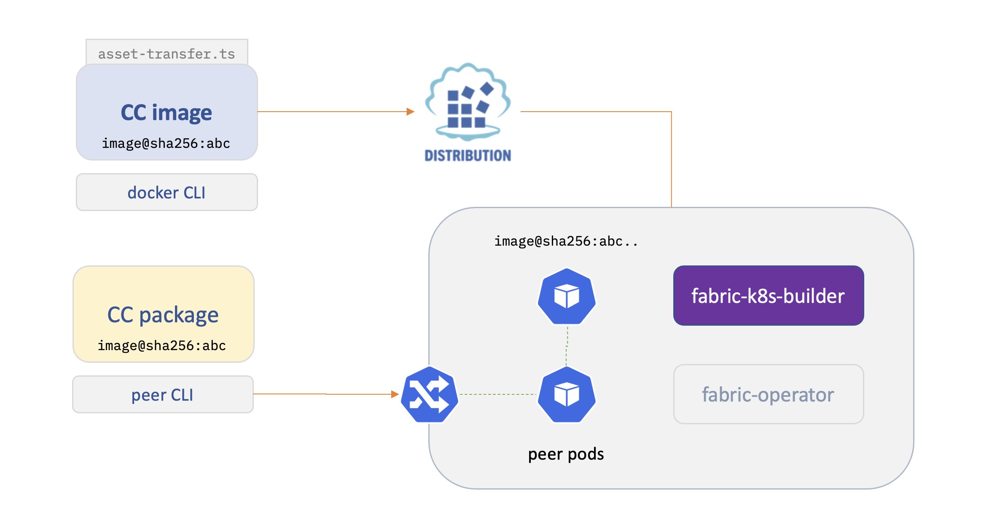

# Chaincode

[前一步: 部署一个fabric网络](20-fabric-zh.md) <==> [下一步: 部署应用](40-bananas-zh.md)

---

根据Fabric传统的智能合约生命周期及管理，智能合约的部署需要通过Fabric administrator来准备和安装定义好的智能合约，通常包括智能合约源码，metadata和运行时（runtime）。
当合约提交到通道时，peers节点将会相应编译过程并将源码作为子进程启动。
这种工作方式可能会引发一些容器运行时的问题。比如在创建智能合约docker镜像的过程中的权限管理问题，以及运行阶段的合约容器适配问题。
在容器和云原生环境上，如k8s，这中经典的智能合约部署过程需要自定义容器服务启动器的支持。

通过Fabric 2.4.1以上提供的[智能合约即服务](https://hyperledger-fabric.readthedocs.io/en/latest/cc_service.html)功能，Fabric管理员可以采用另外一种方式来部署智能合约服务。通过自定义智能合约容器，将智能合约镜像上传至容器registry，并作为k8s服务来启动。通过`peer`命令行执行相关命令来完成这一过程从而完成合约证明周期管理。

通过CCaaS / _no-op_ builder 我们可以减少传统合约生命周期中的相关权限管理问题，并提供了完整的智能合约生命周期管理能力。它将两项新主要责任交给了网络管理员：

- `build` : 管理员需要构建容器镜像并上传。
- `run` : 管理员需要准备`Service`, `Deployment`, 被配置TLS服务端口。

_"But - I just want to write some chaincode!"_

在这个练习中，我们将使用新的[Kubernetes Chaincode Builder](https://github.com/hyperledger-labs/fabric-builder-k8s)来开启外部合约构建通道和从而消除与CCaaS相关的管理负担。

通过使用fabric-k8s-builder, 我们将部署一个通过一下方式定义的智能合约：

1. Preparing a chaincode container image and uploading to a distribution registry.
2. Preparing a `type=k8s` chaincode package specifying the unique and immutable [container image digest](https://github.com/opencontainers/image-spec/blob/main/descriptor.md#digests).
3. Using the `peer` CLI binaries to install and commit the smart contract to a channel.





## 执行

```shell

just check-network

```


## 设置peer命令行配置

```shell

export Rbi_PEER1_ADDRESS=${WORKSHOP_NAMESPACE}-Rbi-peer1-peer.${WORKSHOP_INGRESS_DOMAIN}:443
export Rbi_PEER2_ADDRESS=${WORKSHOP_NAMESPACE}-Rbi-peer2-peer.${WORKSHOP_INGRESS_DOMAIN}:443

# Rbi-peer1: 
export CORE_PEER_LOCALMSPID=RbiMSP
export CORE_PEER_ADDRESS=${Rbi_PEER1_ADDRESS}
export CORE_PEER_TLS_ENABLED=true
export CORE_PEER_MSPCONFIGPATH=${WORKSHOP_CRYPTO}/enrollments/Rbi/users/Rbiadmin/msp
export CORE_PEER_TLS_ROOTCERT_FILE=${WORKSHOP_CRYPTO}/channel-msp/peerOrganizations/Rbi/msp/tlscacerts/tlsca-signcert.pem
export CORE_PEER_CLIENT_CONNTIMEOUT=15s
export CORE_PEER_DELIVERYCLIENT_CONNTIMEOUT=15s
export ORDERER_ENDPOINT=${WORKSHOP_NAMESPACE}-org0-orderersnode1-orderer.${WORKSHOP_INGRESS_DOMAIN}:443
export ORDERER_TLS_CERT=${WORKSHOP_CRYPTO}/channel-msp/ordererOrganizations/org0/orderers/org0-orderersnode1/tls/signcerts/tls-cert.pem

```

## Docker Engine 配置

**NOTE: SKIP THIS STEP IF USING `localho.st` AS THE INGRESS DOMAIN**

Configure the docker engine with the insecure container registry `${WORKSHOP_INGRESS_DOMAIN}:5000`

For example:  (Docker -> Preferences -> Docker Engine)
```json
{
  "insecure-registries": [
    "192-168-205-6.nip.io:5000"
  ]
}
```

- apply and restart

## 合约版本

```shell

CHANNEL_NAME=mychannel
VERSION=v0.0.1
SEQUENCE=1

```

## 构建Chaincode Docker Image

```shell

CHAINCODE_NAME=asset-transfer
CHAINCODE_PACKAGE=${CHAINCODE_NAME}.tgz
CONTAINER_REGISTRY=$WORKSHOP_INGRESS_DOMAIN:5000
CHAINCODE_IMAGE=$CONTAINER_REGISTRY/$CHAINCODE_NAME

# Build the chaincode image
docker build -t $CHAINCODE_IMAGE contracts/$CHAINCODE_NAME-typescript

# Push the image to the insecure container registry
docker push $CHAINCODE_IMAGE

```


## 准备 a k8s Chaincode Package

```shell

IMAGE_DIGEST=$(docker inspect --format='{{index .RepoDigests 0}}' $CHAINCODE_IMAGE | cut -d'@' -f2)

infrastructure/pkgcc.sh -l $CHAINCODE_NAME -n localhost:5000/$CHAINCODE_NAME -d $IMAGE_DIGEST

```

## 安装智能合约

```shell

# Install the chaincode package on both peers in the org 
CORE_PEER_ADDRESS=${Rbi_PEER1_ADDRESS} peer lifecycle chaincode install $CHAINCODE_PACKAGE
CORE_PEER_ADDRESS=${Rbi_PEER2_ADDRESS} peer lifecycle chaincode install $CHAINCODE_PACKAGE

export PACKAGE_ID=$(peer lifecycle chaincode calculatepackageid $CHAINCODE_PACKAGE) && echo $PACKAGE_ID

# Approve the contract for Rbi 
peer lifecycle \
	chaincode       approveformyorg \
	--channelID     ${CHANNEL_NAME} \
	--name          ${CHAINCODE_NAME} \
	--version       ${VERSION} \
	--package-id    ${PACKAGE_ID} \
	--sequence      ${SEQUENCE} \
	--orderer       ${ORDERER_ENDPOINT} \
	--tls --cafile  ${ORDERER_TLS_CERT} \
	--connTimeout   15s

# Commit the contract on the channel
peer lifecycle \
	chaincode       commit \
	--channelID     ${CHANNEL_NAME} \
	--name          ${CHAINCODE_NAME} \
	--version       ${VERSION} \
	--sequence      ${SEQUENCE} \
	--orderer       ${ORDERER_ENDPOINT} \
	--tls --cafile  ${ORDERER_TLS_CERT} \
	--connTimeout   15s

```

```shell

peer chaincode query -n $CHAINCODE_NAME -C mychannel -c '{"Args":["org.hyperledger.fabric:GetMetadata"]}' | jq

```


# 进一步探索

## 编辑，编译，上传，重新安装合约：

```shell

SEQUENCE=$((SEQUENCE + 1))
VERSION=v0.0.$SEQUENCE

```

- Make a change to the contracts/asset-transfer-typescript source code
- build a new chaincode docker image and publish to the local container registry  
- prepare a new chaincode package as above.
- install, approve, and commit as above.


## 基于CI pipeline的结果安装智能合约

```shell

SEQUENCE=$((SEQUENCE + 1))
VERSION=v0.1.3
CHAINCODE_PACKAGE=asset-transfer-typescript-${VERSION}.tgz

```

- Download a chaincode release artifact from GitHub:
```shell

curl -LO https://github.com/hyperledgendary/full-stack-asset-transfer-guide/releases/download/${VERSION}/${CHAINCODE_PACKAGE}

```

- install, approve, and commit as above.


## 通过智能合约即服务进行调试

- prepare a chaincode package with connection.json -> HOST IP:9999  (todo: link to dig out)
- compute CHAINCODE_ID=shasum CC package.tgz
- docker run -e CHAINCODE_ID -e CHAINCODE_SERVER_ADDRESS ... $CHAINCODE_IMAGE in a different shell 
- install, approve, commit as above.


## 通过Ansible进行合约部署

- cp tgz from github releases -> _cfg/
- edit _cfg/cc yaml with package name
- `just ... chaincode`  


---

[前一步: 部署一个fabric网络](20-fabric-zh.md) <==> [下一步: 部署应用](40-bananas-zh.md)
